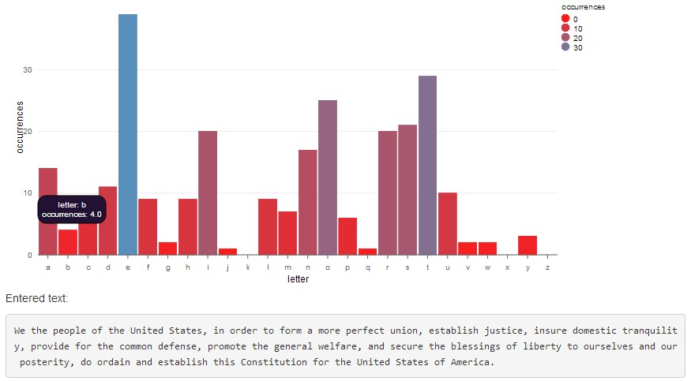
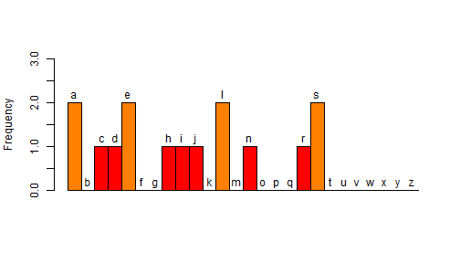
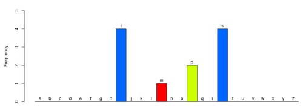
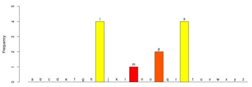
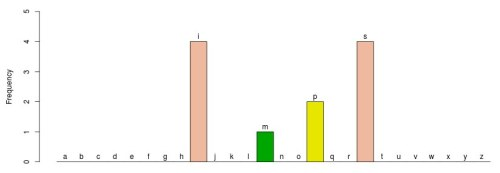
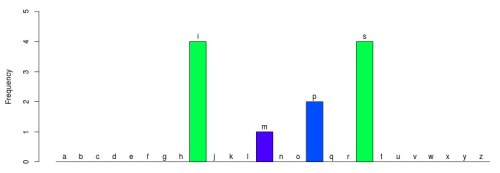

## What It's For

Did you ever really want to know how many b's were in the preamble to the constitution? Or which letter occurs most frequently in Mississippi? Well maybe not, but it's rather common to eventually want to know the character frequency of some text, and if it's longer than the word Mississippi, letting a computer do it is likely what you want.

--- .class #id

## Not Just Useful But FUN!

Character frequencies are interesting. Just yesterday I discovered something about the frequency of the letters of my name, "Charles J. Daniels"

 

All the letters occur either once or twice. I showed my mom and we analyzed several names, including hers and her mom's (my grandma). It turns out the quirks of my name's character frequencies aren't so rare, which makes sense upon reflection.

--- .class #id

## Multiple Graph Styles

With our new Character Frequency App you have options! Choose between different chart types, or pick the chart that offers the colors you prefer.

<table style="width:100px">
<tr><td></td>
<td></td></tr>
<tr><td></td><td></td></tr>
</table>

--- .class #id

## Similar Resources

We're not the only character frequency analyzer in town! No Sir, it's a booming business. You may be interested in these resourrces.

<a href="http://www.characterfrequencyanalyzer.com/">Character Frequency Analyzer .com</a> offers frequency analysis in multiple languages, and also supports punctuation.

<a href="http://www.letterfrequency.org/">LetterFrequency.org</a> lists the order of letters from most common to least common in several contexts and for several languages.

<a href="http://mdickens.me/typing/letter_frequency.html">This page @ mdickens.me</a> lists the most frequent digraphs and trigraphs or English, as well as the most common letters in certain positions of words.

<a href="http://www.csgnetwork.com/documentanalystcalc.html">This page @ csgnetwork.com</a> can tell you word frequencies.
